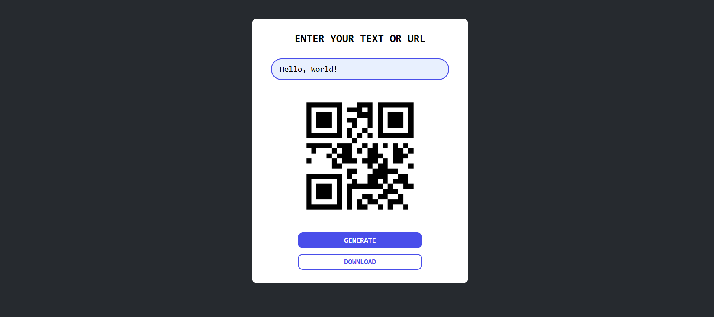
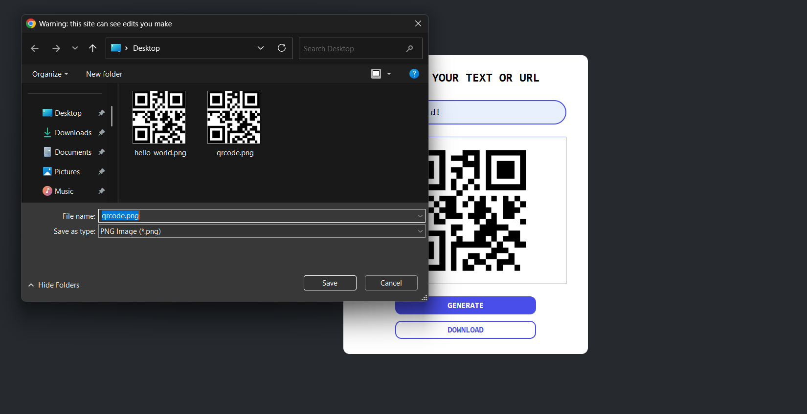

# SIMPLE QRCODE GENERATION APP

Simple web app for generating QR Code based on user's input. It was built with HTML, CSS, and JavaScript. It makes use of a free QR Code generation API provided by "goqr.me". Feel free to use this codebase for personal or commercial use cases.  

---
  

  

---
MIT LICENSE  

---